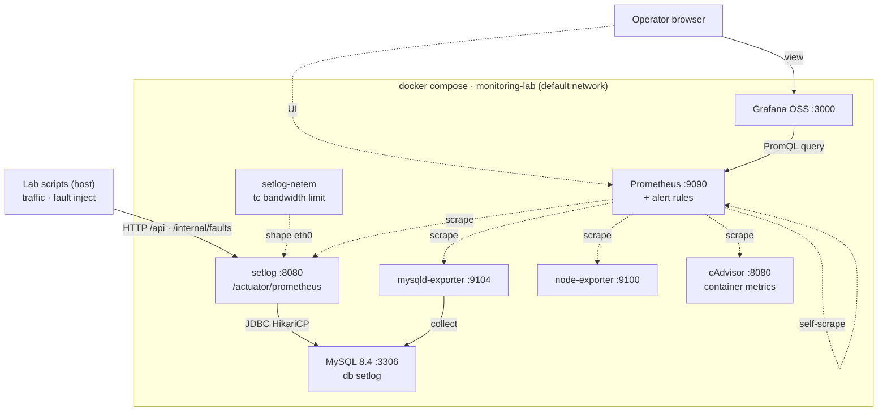

# monitoring-lab Architecture

`docker-compose.yml` 기반 SRE301 모니터링 실습 스택의 아키텍처. 8개 서비스가 compose
default 네트워크 한 개를 공유하며, 외부(호스트)의 lab 스크립트와 브라우저가 진입점이다.

**범례** — 실선: 요청/데이터 흐름 · 점선: Prometheus 스크레이프(pull)

## 서비스 요약

| 서비스 | 이미지 / 빌드 | 포트 | 역할 |
|---|---|---|---|
| **setlog** | `./demo-service` (Spring Boot · JDK21) | `8080` | SetLog API(`/api/*`) + 장애주입(`/internal/faults/*`) + 메트릭(`/actuator/prometheus`) |
| **setlog-netem** | `nicolaka/netshoot` | - | `tc`로 setlog 컨테이너 egress bandwidth 제한 |
| **mysql** | `mysql:8.4` | `3306` | setlog 서비스의 DB(`setlog`), healthcheck로 기동 게이트 |
| **mysqld-exporter** | `prom/mysqld-exporter:v0.14.0` | `9104` | MySQL global_status·innodb 메트릭 노출 |
| **node-exporter** | `prom/node-exporter` | `9100` | host/machine context용 CPU/디스크/파일시스템 메트릭 |
| **cadvisor** | `ghcr.io/google/cadvisor:v0.57.0` | `8081 -> 8080` | Docker container CPU/memory/filesystem I/O/network 메트릭 |
| **prometheus** | `prom/prometheus` | `9090` | 5개 타깃 스크레이프(5s) + SRE301 알림 룰 평가 |
| **grafana** | `grafana/grafana-oss` | `3000` | Prometheus 데이터소스 조회 + SRE301 대시보드 |

## 비고
- **기동 순서(`depends_on`):** setlog·mysqld-exporter는 mysql `service_healthy` 대기, baseline traffic은 setlog-netem health 대기, Prometheus/Grafana는 그 뒤에 기동. 자동 baseline은 여러 worker로 상시 SetLog 트래픽을 만든다.
- **제약:** setlog 컨테이너는 CPU 1 core, memory 512MiB, `/tmp` 96MiB tmpfs, egress 20mbit 기본 제한을 가진다.
- **cAdvisor:** Docker Desktop 29.x의 containerd-backed Docker storage를 읽기 위해 `/rootfs/run/containerd/containerd.sock`를 명시하고 Docker handler 기준(`--docker_only=true`)으로 Compose service label을 수집한다. `node-exporter`는 제거하지 않고 host/machine context용으로 유지한다.
- **볼륨:** named volume `mysql_data`·`prometheus_data`·`grafana_data` + 설정 파일은 호스트 bind-mount(`:ro`).
- **알림:** Prometheus 룰(`prometheus/rules/sre301-alerts.yml` — 증상 5종 + 진단 4종)만 존재. 별도 Alertmanager 컨테이너는 없음.
